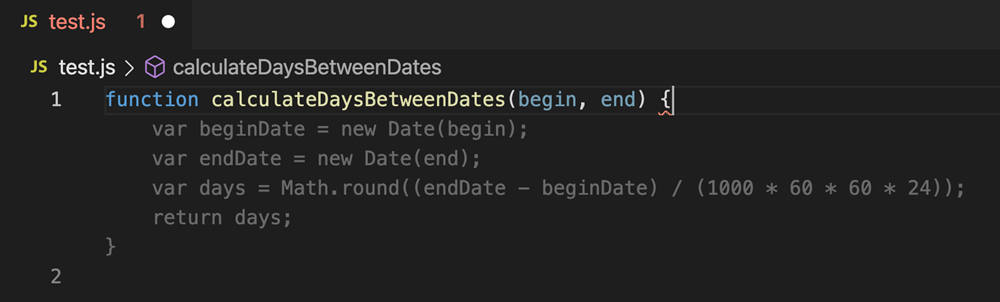
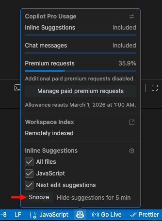
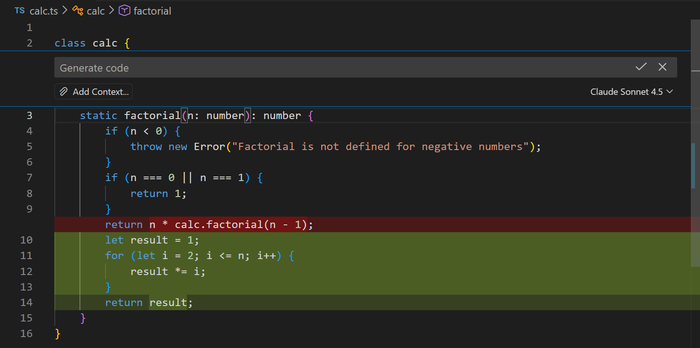
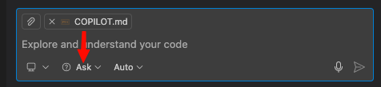
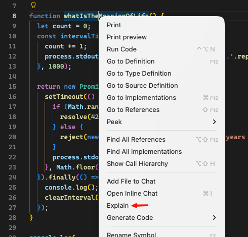

# Using GitHub Copilot in VS Code

GitHub Copilot is an AI coding assistant built into VS Code. It can help you learn, understand code, and write code faster. This guide covers the two features that are most useful while you are learning: **inline suggestions** and **Ask mode**.

> [!NOTE]
> This guide assumes you already have Copilot enabled in VS Code. If you don't see a Copilot icon in the VS Code title bar, ask your mentor for help setting it up.

## Before You Start

A few things to keep in mind:

- Copilot suggests code as you type and can answer questions about code.
- It does **not** always give correct answers. You need to think critically about every suggestion.
- It works best when you already understand what you want to write.
- It is a learning aid, not a shortcut to skip learning.

> [!IMPORTANT]
> Your goal is to **understand** the code you write. If Copilot suggests something and you don't understand it, don't accept it. Instead, ask Copilot to **explain** the suggestion using Ask mode (covered below).

## Inline Suggestions

### What Are Inline Suggestions?

As you type code in the editor, Copilot shows dimmed (gray) text ahead of your cursor. This is called **ghost text**. It is a suggestion for what you might want to type next.



### How to Respond to a Suggestion

| Action | Mac | Windows / Linux |
| --- | --- | --- |
| Accept the full suggestion | <kbd>Tab</kbd> | <kbd>Tab</kbd> |
| Accept word by word | <kbd>Cmd</kbd>+<kbd>&#8594;</kbd> | <kbd>Ctrl</kbd>+<kbd>&#8594;</kbd> |
| Dismiss the suggestion | <kbd>Esc</kbd> | <kbd>Esc</kbd> |
| See the next suggestion | <kbd>Option</kbd>+<kbd>]</kbd> | <kbd>Alt</kbd>+<kbd>]</kbd> |
| See the previous suggestion | <kbd>Option</kbd>+<kbd>[</kbd> | <kbd>Alt</kbd>+<kbd>[</kbd> |

> [!TIP]
> **Accept word by word** is often the best approach when you are learning. It lets you read and think about each part of the suggestion before accepting it. You stay in control.

### Snoozing or Disabling Inline Suggestions

Inline suggestions can sometimes be distracting. If ghost text keeps appearing while you are trying to think through a problem, it can disrupt your train of thought. In that case, you can temporarily snooze or completely disable inline suggestions.

Click the **GitHub Copilot icon** in the VS Code status bar (bottom of the window). A menu will appear that lets you snooze suggestions for a period of time or disable them entirely. You can turn them back on from the same menu whenever you are ready.



> [!TIP]
> There is no shame in turning off suggestions while you think. Experienced developers do this too. Turn them back on when you are ready to start typing again.

### Example: Completing a TODO Function

Imagine you are working on the `getMe()` function in `services.starter.js`. The starter code looks like this:

```javascript
const getMe = async () => {
  // TODO
};
```

You delete the `// TODO` comment and start typing `const response = await fetch`. Copilot might suggest something like this:

```javascript
const getMe = async () => {
  const response = await fetch(`${BASE_URL}/users/me`, {    // ghost text
    headers: {                                                // ghost text
      Authorization: `Bearer ${getToken()}`,                  // ghost text
    },                                                        // ghost text
  });                                                         // ghost text
```

Before pressing <kbd>Tab</kbd>, ask yourself:

1. Does the URL look correct? Check the API documentation or the function's JSDoc comment.
2. Is the HTTP method right? (`fetch` defaults to GET, which is correct here.)
3. Does the `Authorization` header format match what the server expects?

If you are unsure about any of these, **don't accept the suggestion**. Instead, check the docs or ask Copilot to explain it (see the next section).

> [!WARNING]
> Copilot bases its suggestions on patterns in your code and public code. It does **not** read the assignment instructions or the API documentation. Always verify suggestions yourself.

## Ask Mode (Copilot Chat)

### What Is Ask Mode?

Ask mode lets you have a conversation with Copilot about your code. You can ask it to explain code, help you understand errors, or teach you a concept. The key point: **Ask mode only provides information. It never changes your files.**

> [!NOTE]
> Ask mode is read-only. It will not modify any of your files. This makes it safe to use at any time.

### Opening Copilot Chat

#### Method 1: Chat Panel

The Chat panel is best for longer questions and follow-up conversations.

| Action | Mac | Windows / Linux |
| --- | --- | --- |
| Open Chat panel | <kbd>Ctrl</kbd>+<kbd>Cmd</kbd>+<kbd>I</kbd> | <kbd>Ctrl</kbd>+<kbd>Alt</kbd>+<kbd>I</kbd> |

You can also click the Copilot icon in the VS Code title bar:


#### Method 2: Inline Chat

Inline Chat opens a small chat box right next to your code in the editor. It is handy for quick questions about a specific line or function.

| Action | Mac | Windows / Linux |
| --- | --- | --- |
| Open Inline Chat | <kbd>Cmd</kbd>+<kbd>I</kbd> | <kbd>Ctrl</kbd>+<kbd>I</kbd> |



### Make Sure You Are in Ask Mode

At the bottom of the Chat panel, you will see a mode dropdown. Make sure it says **Ask**. If it says something else (like "Agent" or "Plan"), click the dropdown and select **Ask**.



### Useful Chat Commands

You can type a slash command to tell Copilot what kind of help you need:

| Command | What it does |
| --- | --- |
| `/explain` | Explains selected code in plain language |
| `/fix` | Suggests how to fix a problem in selected code |

You can also just type a question in plain English without any slash command. For example:

```
What does response.ok mean in fetch?
```

### Adding Context to Your Questions

Copilot can only help you if it knows what code you are asking about. This is called **context**. The more relevant context Copilot has, the better its answers will be.

Here is how context works:

- **Your currently open file** is automatically included. If you have `services.starter.js` open in the editor, Copilot already knows about that file when you ask a question.
- **Selected text** narrows the focus. If you select a specific function or a few lines before asking, Copilot treats that selection as the main focus of your question.
- **Dragging files or folders** into the Chat input area adds them as context. This is useful when you want to ask about a file you don't have open, or about how multiple files work together.
- **The `#` symbol** lets you type a reference directly in the Chat. For example, type `#file` and a list of your project files will appear for you to pick from. You can also use `#selection` to refer to whatever text you currently have selected in the editor.

> [!TIP]
> Start simple: open the file you want to ask about, select the relevant code, and ask your question. That is enough context for most questions.

### Ways to Ask About Your Code

#### 1. Select code, then ask

Select some code in the editor, then open the Chat panel and type your question. Copilot will use your selection as context.

For example: select the `createUser()` function in `services.starter.js` and ask:

```
Explain this function line by line
```

#### 2. Right-click and ask

Select code in the editor, right-click, and choose **Explain** from the context menu. Then select an option such as **Explain** or type your own question.



#### 3. Drag a file or folder into the Chat

From the VS Code Explorer, you can drag a file or folder directly into the Chat input area. Then type your question about its contents.

### Five Things to Try Right Now

1. Open `services.starter.js` from one of the assignments. Select the `getHello()` function and type `/explain` in the Chat.
2. Ask in the Chat (no code selected): `What is the difference between response.ok and response.status in fetch?`
3. Select a function that has a `// TODO` comment and ask: `What does this function need to do based on the comments?`
4. If you get an error in the terminal, copy the error message into the Chat and ask: `What does this error mean and how do I fix it?`
5. Ask: `What does async/await do in JavaScript? Explain it simply.`

> [!TIP]
> You can ask follow-up questions. If Copilot's explanation uses a word you don't understand, just ask: "What does [that word] mean?"

## Recommended Workflow

Here is how to combine inline suggestions and Ask mode when working on an assignment:

1. **Read the assignment instructions** in the README first.
2. **Open the starter file** (e.g., `services.starter.js`) and read the existing code and comments.
3. **Use Ask mode to understand** any code you didn't write. Select it and ask Copilot to explain it.
4. **Start typing your solution.** When ghost text appears, read it carefully before accepting.
5. **Accept word by word** (<kbd>Cmd</kbd>/<kbd>Ctrl</kbd>+<kbd>&#8594;</kbd>) to stay in control.
6. **Verify every suggestion** against the assignment instructions and API documentation.
7. **If something doesn't work**, copy the error message into the Chat and ask what it means.
8. **Run the tests** (`npm test`) to check your work.

> [!TIP]
> Think of Copilot as a study partner who can explain things, not as someone who does the work for you. The learning happens when **you** write and understand the code.

## What About Agent Mode and Plan Mode?

You may notice other options in the Chat mode dropdown: **Agent** and **Plan**.

- **Agent mode** can autonomously plan and implement changes across multiple files, run terminal commands, and invoke tools.
- **Plan mode** creates a structured, step-by-step implementation plan before writing any code. It hands the plan off to an implementation agent when you approve it.

At this stage of the program, we want you to focus on writing code yourself. You will learn more by typing code and understanding each line than by having an AI write it for you. Your mentors will introduce these more advanced modes when the time is right.

> [!NOTE]
> If the Chat dropdown is set to "Agent" or "Plan", Copilot may try to change your files. Always keep it set to **Ask** for now.

## Quick Reference

All keyboard shortcuts in one place:

| Action | Mac | Windows / Linux |
| --- | --- | --- |
| Accept inline suggestion | <kbd>Tab</kbd> | <kbd>Tab</kbd> |
| Accept word by word | <kbd>Cmd</kbd>+<kbd>&#8594;</kbd> | <kbd>Ctrl</kbd>+<kbd>&#8594;</kbd> |
| Dismiss suggestion | <kbd>Esc</kbd> | <kbd>Esc</kbd> |
| Next suggestion | <kbd>Option</kbd>+<kbd>]</kbd> | <kbd>Alt</kbd>+<kbd>]</kbd> |
| Previous suggestion | <kbd>Option</kbd>+<kbd>[</kbd> | <kbd>Alt</kbd>+<kbd>[</kbd> |
| Open Chat panel | <kbd>Ctrl</kbd>+<kbd>Cmd</kbd>+<kbd>I</kbd> | <kbd>Ctrl</kbd>+<kbd>Alt</kbd>+<kbd>I</kbd> |
| Open Inline Chat | <kbd>Cmd</kbd>+<kbd>I</kbd> | <kbd>Ctrl</kbd>+<kbd>I</kbd> |
