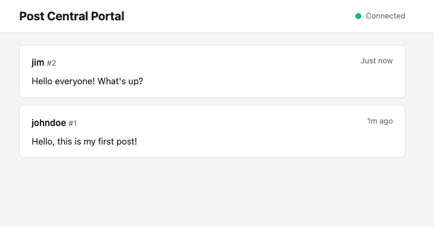

# Lesson Plan: Introduction to Web APIs

- **Duration:** 45 minutes
- **Topic:** Understanding web APIs, reading API documentation, making requests
- **Tools:** curl, Postman, Scalar OpenAPI interface
- **Server:** Post Central (run by instructor)

## Introduction

This exercise uses an API server, called Post Central, that runs on the teacher's computer. Trainees can send HTTP requests from their own laptop to the API server, using the local IP address (e.g. 192.168.xxx.xxx) of the teacher's machine. This local IP address will be shown in the terminal when the server is started.

The API server statically serves a portal application that visualizes the requests received from the endpoints in WhatsApp-like format. The portal communicates with the API in real-time using WebSockets.

The Post Central API provides endpoints for the following:

- Register a user (username, password)
- User login
- Post a text message
- Update a text message
- Delete a text message
- Get all messages
- Get the user’s profile
- Get a list of users
- Delete the user account

The Register and Login endpoints return a token.

All endpoints except Register and Login are protected through Bearer authentication.

A posted text message is owned by the user that sent it. It can only be updated or deleted by the owner. A user account can only be deleted by its owner.

During the exercise, the teacher can run the portal and keep it open on the big screen.

Trainees will work in pairs. The laptop of one of the trainees will run an instance of the portal. The laptop of the other trainee will be used to send HTTP requests. Building these requests with curl and Postman is done through pair programming, although in this exercise there is no actual programming done. Part of the exercise is practicing the reading and interpretation of API documentation.

## Setup

### Instructor

- Start the Post Central server: `npm start`
- Open the portal on the projector: `http://localhost:3000/portal`
- Note the local network IP displayed in the terminal — trainees will use this
- Have the README, `/api-docs`, and `/portal` ready to show

### Trainees (pairs)

- **Laptop A (portal):** Open `http://<instructor-ip>:3000/portal` in a browser
- **Laptop B (workstation):** Open a terminal, Postman, and `http://<instructor-ip>:3000/api-docs` in a browser

## Schedule Overview

| Time | Section | Format |
| --- | --- | --- |
| 0–5 min | Session introduction | Instructor talk |
| 5–10 min | Demo: Portal, API docs, README | Instructor demo |
| 10–12 min | Pair setup | Trainees |
| 12–17 min | Exercise 1: First request with curl | Pair exercise |
| 17–22 min | Exercise 2: Explore the Scalar API docs | Pair exercise |
| 22–30 min | Exercise 3: Register and login with curl | Pair exercise |
| 30–38 min | Exercise 4: Create a post with Postman | Pair exercise |
| 38–43 min | Exercise 5: Update and delete via Scalar | Pair exercise |
| 43–45 min | Wrap-up | Instructor talk |

---

## 1. Session Introduction (5 min)

_Instructor sets the scene._

Explain what trainees will be doing in this session:

- You learned what a web API is — now you are going to **use one**
- The instructor is running a server called **Post Central** — a simple social posting API. It is live right now on the local network.
- In this session you will make real HTTP requests to that server using three different tools: **curl** (command line), **Postman** (graphical client), and the **Scalar API docs** (interactive documentation in the browser)
- You will work in pairs: one laptop shows a **live portal** that updates in real time whenever anyone interacts with the API — this is your visual feedback
- The other laptop is your **workstation** where you will read the docs and send requests
- By the end of this session you will have registered a user, logged in, created posts, and seen them appear on the portal — all through the API

## 2. Demo: Portal, API Docs, README (5 min)

_Instructor shows all three on the projector._

1. **The Portal** (`/portal`) — a live view of all posts and user activity. This is what a front-end application looks like when it consumes an API. Every time someone makes an API request that changes data, the portal updates in real time.

2. **The Scalar API Docs** (`/api-docs`) — interactive documentation generated from the API specification. You can read what each endpoint does and try it directly from the browser.

3. **The README** — written documentation that explains each endpoint, what parameters it expects, and what responses it returns.

Key point: these are three different ways to understand the same API. Good developers use all of them.

## 3. Pair Setup (2 min)

Trainees get into pairs and set up their laptops:

- **Laptop A:** Open the portal at `http://<instructor-ip>:3000/portal`
- **Laptop B:** Open a terminal and the Scalar docs at `http://<instructor-ip>:3000/api-docs`

The instructor writes the server IP address on the board.

---

## 4. Exercise 1: First Request with curl (5 min)

**Goal:** Make your first API request and see the response.

The Post Central API has one endpoint that does not require authentication: `GET /posts/hello`. Find this endpoint in the README or the Scalar docs, then use curl to call it from the terminal.

**Hints:**

- The basic curl syntax is: `curl <url>`
- Try adding the `-v` flag to see the full HTTP conversation (headers, status code)

**Check:** The trainee on Laptop A does not see anything change on the portal — why? Because this endpoint only reads data, it does not create or change anything.

**Discussion points for instructors walking around:**

- What is the status code?
- What format is the response in?
- What do the `-v` headers tell you?

## 5. Exercise 2: Explore the Scalar API Docs (5 min)

**Goal:** Use the interactive API documentation to make the same request, then explore what else the API offers.

1. Open the Scalar docs at `/api-docs` in the browser
2. Find the `GET /posts/hello` endpoint
3. Use the "Try it" feature to send the request — compare the result with what curl returned
4. Browse the other endpoints — which ones require authentication? What does "Bearer token" mean?

**Discussion points for instructors walking around:**

- The Scalar docs are generated from an OpenAPI specification — a standard way to describe APIs
- Notice that some endpoints show an authentication requirement — these require a token
- Point out the request and response schemas

## 6. Exercise 3: Register and Login with curl (8 min)

**Goal:** Register a new user, receive a token, and understand authentication.

1. Look at the `POST /users/register` endpoint in the README or Scalar docs. What fields does it need?
2. Use curl to register a new user. You will need to:
   - Send a POST request (check how to do this with curl)
   - Set the `Content-Type` header to `application/json`
   - Include a JSON body with your chosen username and password
3. Copy the **token** from the response — you will need it for the next exercises
4. Check Laptop A: did the portal show a notification that a new user registered?

**Bonus:** Try logging in with `POST /users/login` using the same credentials. Try logging in with a wrong password — what happens?

**Discussion points for instructors walking around:**

- The token is a JWT (JSON Web Token) — it proves who you are without sending your password every time
- Show how `Authorization: Bearer <token>` works
- What happened on the portal when you registered? (real-time WebSocket update)

## 7. Exercise 4: Create a Post with Postman (8 min)

**Goal:** Use Postman to create a post, using your token for authentication.

1. Open Postman and create a new request
2. Check the `POST /posts` endpoint in the docs — what URL, method, headers, and body does it need?
3. Configure the request in Postman:
   - Set the correct HTTP method and URL
   - Add the `Authorization` header with your Bearer token
   - Add a JSON body with your post text
4. Send the request and check the response
5. Look at Laptop A — your post should appear on the portal in real time

**Bonus:** Use Postman (or curl) to call `GET /posts/me` with your token to see all your posts.

**Discussion points for instructors walking around:**

- Postman makes it easier to set headers and body compared to curl
- Show the different tabs in Postman: Params, Headers, Body, Auth
- Compare the experience: curl is fast for simple requests, Postman is better for complex ones

## 8. Exercise 5: Update and Delete via Scalar (5 min)

**Goal:** Use the Scalar docs interface to update and delete posts. Discover what happens when you try to modify someone else's post.

1. In the Scalar docs, find the `PUT /posts/:id` endpoint
2. Update one of your own posts — you will need your token and the post ID (from exercise 4)
3. Check the portal — does it show the post as edited?
4. Now try to delete a post that belongs to someone else (pick any ID that is not yours)
5. What status code and message do you get? Why?

**Discussion points for instructors walking around:**

- Status 403 Forbidden means the server understood your request but refused it — you do not own that post
- This is **authorization** (what you are allowed to do) vs **authentication** (who you are)
- The portal shows deleted posts with a visual indicator

## 9. Wrap-up (2 min)

_Instructor-led recap._

- You used **three different tools** to interact with the same API: curl, Postman, and the Scalar docs interface
- The tool does not matter — what matters is understanding the **documentation** and the **HTTP protocol**
- Every web application you use (social media, banking, maps) works this way under the hood: a front end sending HTTP requests to an API
- Next week you will build your own front end that talks to this API

---

## Instructor Notes

### Timing tips

- Exercises 3 and 4 are the core of the lesson — protect this time
- If pairs finish early, suggest the bonus tasks or have them help neighbouring pairs
- If running behind, exercise 5 can be shortened to a quick instructor demo

### Common issues

- **curl syntax errors:** Trainees often forget quotes around the URL or JSON body. Remind them that the shell needs quotes around strings with special characters.
- **Token expired or lost:** Have trainees log in again with `POST /users/login` to get a fresh token
- **Wrong Content-Type:** If trainees get unexpected errors when POSTing, check that they set `Content-Type: application/json`
- **Postman body format:** Make sure trainees select "raw" and "JSON" in the body tab, not "form-data"

### Role of the two instructors

- One instructor leads from the front (intro, demo, wrap-up)
- Both instructors circulate during exercises to help pairs who are stuck
- Prioritise pairs who have not made their first successful authenticated request by minute 25
